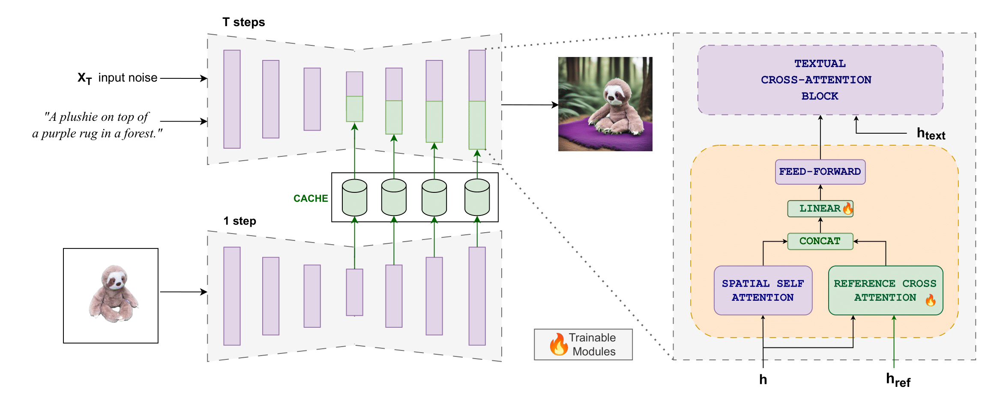

# DreamCache
DreamCache: Finetuning-Free Lightweight Personalized Image Generation via Feature Caching

<div align="center">

</div>




## ⚙️ Set-up
Create a conda environment `dreamcache` using
```
conda env create -f environment.yaml
conda activate dreamcache
```

## ⏬ Download

Download the pretained [Stable Diffusion 2.1](https://huggingface.co/stabilityai/stable-diffusion-2-1-base/blob/main/v2-1_512-ema-pruned.ckpt) and move it here: `/models/ldm/stable_diffusion_v2`

Download the [pretrained adapter](https://drive.google.com/drive/folders/11qgm_oXMgHg4jiD7Q2S0rWeIfHhTPg0K?usp=sharing)

Download the training dataset: (available soon!)

Download DreamBench:
```
git clone https://github.com/google/dreambooth.git

```

## 💻 Training

To run a training job, set main training arguments and run:

```
bash scripts/train_multi_masked.sh

```


## 🚀 Inference & Evals
To generate personalized images modify and run: `bash scripts/sample_ref.sh` 

To sample the entire dreambench dataset first remove background from dreambench and filter according to Kosmos-G. Adjust path in remove_background.py:

```
bash scripts/remove_dreambench.sh /path/to/dreambooth/dataset
python scripts/remove_background.py 

```

To generate samples adjust the main arguments and run:

```
bash scripts/generate_dreambooth_mult.sh

```

To run evaluations on dreambooth run: 

```
bash scripts/evaluate_dreambooth.sh

```


## Gradio Demo
To run a gradio demo set main parameters in gradio_app.py and then run `python gradio_app.py`


## 💐 Acknowledgements
This code repository is based on several prior works: [Textual Inversion](https://github.com/rinongal/textual_inversion) [ViCo](https://github.com/haoosz/ViCo/tree/main) [Kosmos-G] (https://github.com/xichenpan/Kosmos-G)